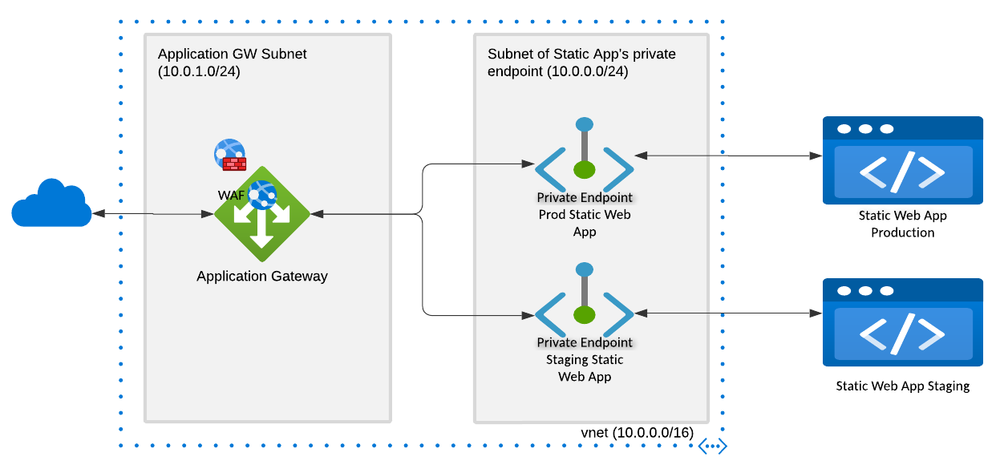
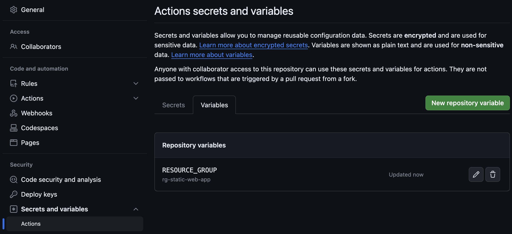
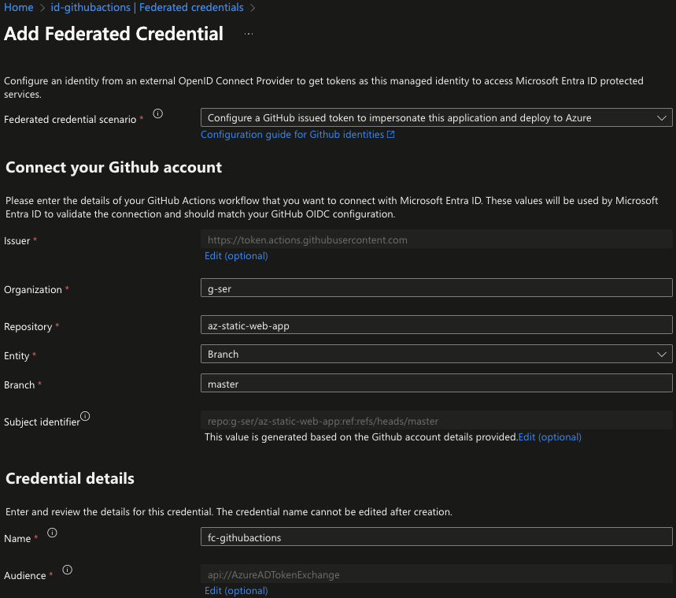
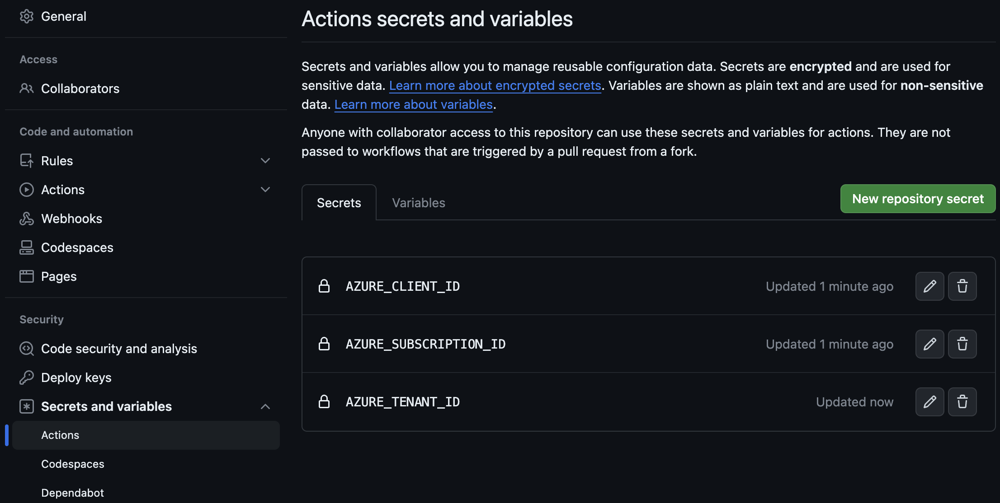
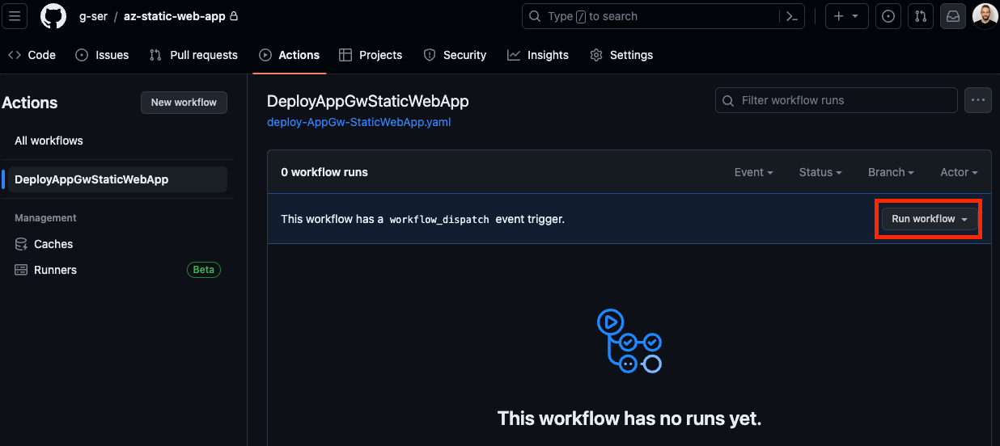

# AZ-Static-Web-App

## Repo Content<a name="repo_content"></a>

The IaC contained in this repository is meant to run using a GitHub action [workflow](/.github/workflows/deploy-AppGw-StaticWebApp.yaml). When the workflow is triggered, it creates an Azure Static Web App and an Application Gateway in front of the Static Web App thanks to the Bicep [template](/bicep/main.bicep). The invocation of the Bicep template happens with the [GitHub Action for ARM deployment](https://github.com/marketplace/actions/deploy-azure-resource-manager-arm-template). Once the infrastructure is provisioned, a second job which uses the [Azure Static Web Apps Deploy](https://github.com/marketplace/actions/azure-static-web-apps-deploy) GitHub action deploys a simple static HTML website on the Azure Static Web App.

## Architecture<a name="architecture"></a>




## Prerequisites for working with the repo<a name="prerequisites"></a>

Some resources need to pre-exist in Azure in order for the [workflow](/.github/workflows/deploy-AppGw-StaticWebApp.yaml) to be able to provision the infrastructure described in the Bicep [template](/bicep/main.bicep). First of all the resource group where the resources will be provisioned needs to be there. In addition, the [integration](#integration-between-github-actions-and-azure) between GitHub Actions and Azure needs to be in place.

### Creation of Resource Group

A resource group named ```rg-static-web-app``` was created in Azure. The name of the resource group is stored as variable in GitHub settings as in the picture below:



Note that the Azure ARM deploy action in the [workflow](/.github/workflows/deploy-AppGw-StaticWebApp.yaml) uses the variable ```RESOURCE_GROUP```

### Integration between GitHub Actions and Azure<a name="integration-github-azure"></a>

> [!NOTE] 
> For details about integrating GitHub Actions with Azure using managed identities together with Federated Credentials check the article: [Use GitHub Actions with User-Assigned Managed Identity](https://yourazurecoach.com/2022/12/29/use-github-actions-with-user-assigned-managed-identity/)

Since the purpose of this repo is to create the needed resources on Azure (e.g., Static Web App, Azure Application Gateway, Azure Virtual Network etc.) using a GitHub action workflow, there is the need for GitHub to authenticate against Azure. This happens thanks to Azure managed identities. One managed identity called ```id-githubactions``` was pre-created. The ```id-githubactions``` is assigned the Contributor role on the pre-created ```rg-static-web-app``` resource group. The ```id-githubactions``` managed identity, uses federated credentials which were created from the Azure portal as in the picture below.



The ```AZURE_CLIENT_ID```, ```AZURE_SUBSCRIPTION_ID``` and ```AZURE_TENANT_ID``` of ```id-githubactions``` were configured in GitHub settings as in the picture below:



Note that the Azure login action in the [workflow](/.github/workflows/deploy-AppGw-StaticWebApp.yaml) uses the secrets ```AZURE_CLIENT_ID```, ```AZURE_SUBSCRIPTION_ID``` and ```AZURE_TENANT_ID``` to authenticate with OpenID Connect.

## Provisioning the Static Web App and the Application Gateway by running the GitHub Action Workflow<a name="provisioning_a_static_web_app"></a>

The name of the static web app is hardcoded in [parameters](/bicep/main.bicepparam/) file. In order to create the setup of the picture illustrated in the [Architecture](#architecture) section, you need to run the workflow ```DeployAppGwStaticWebApp``` as shown in the picture below. Note that the workflow is configured to run manually using the GitHub portal (consider configuring the workflow to run automatically (e.g. on push events) in case you move the setup of the current repo in a real environment).


